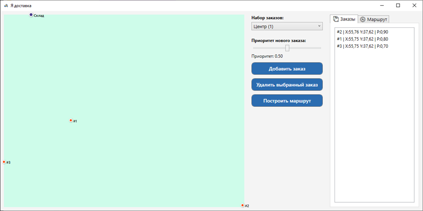

# 🚚 Система визуализации и оптимизации маршрутов доставки

WPF-приложение для построения маршрутов доставки с учётом приоритета заказов. Использует библиотеку **BestDelivery** для валидации маршрутов и расчёта стоимости.

## 📌 Возможности

- Выбор одного из шести готовых массивов заказов
- Визуализация маршрута на карте (точки и стрелки)
- Построение оптимального маршрута с учётом приоритета
- Добавление/удаление заказов вручную
- Динамическая перерисовка маршрута при изменении размера окна
- Отображение стоимости маршрута и порядка заказов

## 🧩 Используемый алгоритм

Реализован модифицированный жадный алгоритм ближайшего соседа:

Оценка = расстояние / (приоритет + 0.01)

Это позволяет учитывать приоритет и при этом поддерживать оптимальность по расстоянию. Для валидации используется метод `TestRoutingSolution` из библиотеки BestDelivery.

## 🖥️ Интерфейс

### Основные области:
- **Левая панель** — выбор массива заказов, задание приоритета, кнопки
- **Центр** — карта с визуализацией маршрута
- **Правая панель** — информация о заказах и маршруте
  

## 🔄 Блок-схема работы

| Метод                       | Назначение                                    |
| --------------------------- | --------------------------------------------- |
| `AddOrder_Click`            | Добавление нового заказа с приоритетом        |
| `RemoveSelectedOrder_Click` | Удаление выбранного заказа                    |
| `BuildRoute_Click`          | Построение маршрута с приоритетом             |
| `DrawMap`                   | Отрисовка всех точек на карте                 |
| `DrawRoute`                 | Отрисовка маршрута стрелками                  |
| `RefreshOrderList`          | Обновление списка заказов                     |
| `ShowRouteInfo`             | Отображение информации о маршруте             |
| `MapCanvas_SizeChanged`     | Перерисовка карты при изменении размеров окна |
